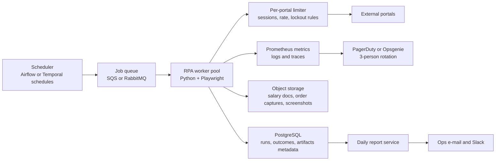

# Zentist RPA Production Design

This design scales the test-task code to about 100 external portals, a few hundred scheduled jobs per
day, and roughly 30,000 daily work items. The implementation in this repository is a small version of the
same pattern: `BasePortalRunnerZX` owns common lifecycle, retries, metrics and persistence; portal classes
own only portal-specific browser actions.

## Architecture

### Figure ZQ9

Production would use PostgreSQL instead of SQLite, object storage instead of a local artifact folder, and
a queue-backed worker fleet instead of one CLI process. The core contract remains the same: each work item
gets a durable outcome, and a portal failure cannot erase already processed items.

## Orchestration and Throughput

I would schedule portal jobs with Temporal if long-running workflows and retries are first-class needs, or
Airflow if the company already operates DAG-based scheduling. For this scale, both work; I would choose
Temporal for stronger per-item recovery, activity retries, timeouts, and workflow visibility. A scheduler
creates a daily set of portal jobs, each job expands to item tasks, and item tasks are delivered through a
queue to Playwright workers.

30,000 items per day is modest if concurrency is bounded correctly. For example, a 10-hour window needs
about 50 items per minute overall. With 20 workers and average 2 minute item time, the system can process
about 600 items per hour. Capacity is increased by adding workers, not by making one browser session do
too much at once.

Concurrency is bounded at three levels:

- Global worker concurrency: maximum browser contexts per worker host.
- Portal concurrency: per-portal leases, usually 1 to N active sessions depending on portal rules.
- Credential concurrency: one lease per login if a portal allows only one active session.

## Per-Portal Constraints

Each portal has a `PortalProfile` stored in configuration: rate limits, allowed session count, lockout
threshold, timeout budget, retry policy and maintenance windows. Workers acquire a portal lease before
opening a session. If a portal permits one login session, the lease count is 1 even if the global worker
pool has spare capacity.

For portals with lockout risk, authentication failures trip a circuit breaker. The breaker pauses new
attempts for that credential and alerts the on-call operator before repeated login attempts lock the
account. For slow portals, the scheduler can lower concurrency and extend deadlines without slowing other
portals.

## Isolation and Failure

Each portal job runs in its own workflow and each item is recorded after it finishes. A browser crash,
dropped session, timeout or selector failure marks the current item as failed with a reason, closes the
context, and continues with the next item when the portal profile allows it. If setup fails before item
processing starts, every queued item receives a failure outcome for that run, as the local
`BasePortalRunnerZX` does.

Workers are stateless. If a worker host dies, the queue visibility timeout or Temporal activity timeout
returns unfinished work to the queue. Items already marked success are not repeated on same-day recovery
unless an operator explicitly requests a forced refresh.

## Monitoring and Observability

I would use Prometheus for metrics, Grafana for dashboards, Loki or Elasticsearch for structured logs,
OpenTelemetry for traces, and PagerDuty or Opsgenie for alerting. A 3-person team needs high-signal
dashboards, not raw stack traces.

Metrics to track:

- Job status by portal: running, success, partial failure, failed, stuck.
- Item outcomes by portal and reason.
- Duration percentiles for login, navigation, item processing and upload.
- Retry counts, timeout counts and browser crash counts.
- Queue depth and oldest queued item age.
- Portal-specific circuit breaker state.
- Data quality checks, such as record count deltas and field distribution changes.

Stuck jobs are detected by heartbeat age. Failed jobs alert immediately when they affect critical portals
or exceed an error budget. Silent failures are caught with canaries and data validation: each portal has
expected layout fingerprints, required fields, minimum item counts, and anomaly checks. If a bot reports
success but collected the wrong data after a layout change, validation detects unusual null rates, changed
labels, missing screenshots, or drift from historical totals.

## Idempotency and Recovery

Every item has an idempotency key: `business_date + portal + item_key`. A same-day rerun updates the
existing outcome instead of inserting duplicates. Portal actions are written to be convergent: set the
target state, do not blindly append state. For example, OrangeHRM refreshes Job Title and Employment
Status every run but uploads the salary attachment only if the expected attachment is absent.

Recovery starts from durable outcomes. On rerun, the scheduler can skip successes, retry failures, or run a
forced full reconciliation. The default production mode is retry failures and stale unknowns, then produce
a daily report that includes both recovered and still-failed items.

## Technology Choices

I would use Python 3.11, Playwright, Pytest, Temporal, PostgreSQL, S3-compatible object storage,
Prometheus, Grafana, OpenTelemetry and PagerDuty. Python and Playwright fit browser automation well and
match the test task. Temporal is preferable to cron plus ad hoc retry code because it gives durable
workflows, activity retries, cancellation and visibility.

I would reject a single long-running Selenium host because it couples all portals to one failure domain and
makes recovery hard. I would also reject unbounded async browser automation. Browser contexts consume real
CPU and memory, and external portals often punish aggressive concurrency. Workers should use processes or
containers with a small number of browser contexts each; inside a portal session, code can be synchronous
for clarity unless the portal has a proven benefit from async IO.

## Operating It

A 3-person team would operate by exception. Dashboards show today's job progress, failed portals, stuck
items, SLA risk and data-quality drift. Alerts go to the on-call person during business-critical windows,
with Slack summaries for non-urgent degradation.

Secrets live in a managed vault such as AWS Secrets Manager, HashiCorp Vault or 1Password Secrets
Automation. Workers receive short-lived credentials or fetch secrets at runtime. Rotation is tracked per
portal, and lockout-prone credentials have lower retry limits plus explicit circuit breakers.

When a portal is down through no fault of ours, the system degrades by pausing that portal, marking
affected items as failed or deferred with a clear reason, notifying operators, and continuing all other
portals. The business receives a coherent report that says which portals completed, which partially
completed, and what is waiting on the external provider.
